# Configure-ACI-using-Ansible-Lab-Guide


## Table of Contents

Introduction

Connecting to the Lab

Lab 1: Create Tenant

Lab 2: Create VRF and Bridge Domain

Lab 3: Create Contracts	

Lab 4: Create ANP and EPG

## Introduction

Ansible is a configuration management tool which will help in creating configuration scripts which helps in deploying numerous objects in ACI.
ACI has more than 30 modules which are part of Ansible core modules. In this section, we’ll use few of the ACI modules to learn how to use Ansible for automating ACI configuration. The objects that we create and configure in each of the lab exercises is used in the next exercise. It is recommended to go execute all the lab exercises in the order they are presented.


## Connecting to the Lab

Access the dCloud lab using the following link: 
[dcloud lab](https://dcloud2-sjc.cisco.com/session/354425?returnPathTitleKey=view-session)

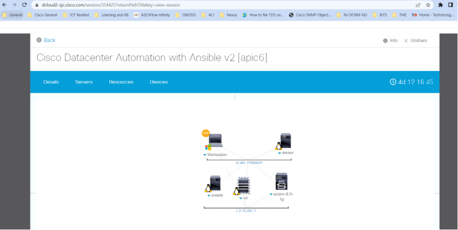

Click on the Workstation to get the details, here you will find the link to open the RDP session to the workstation:

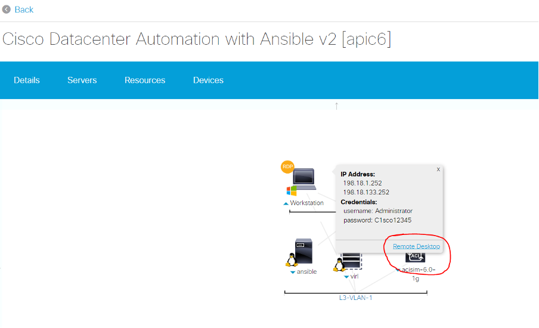

Once you open a Web RDP session to the workstation, you should be able to access the Ansible server via a pre-configured putty session:

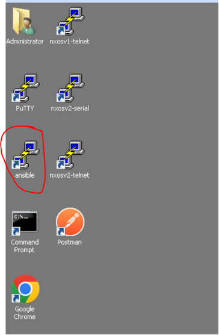

This should give you access to the path where the Ansible playbooks for ACI are created in an order. You can access them using “cd” command and follow the lab instructions to complete your learning:

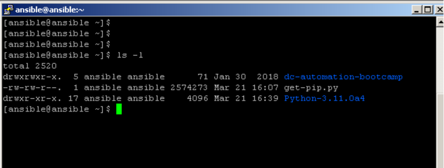

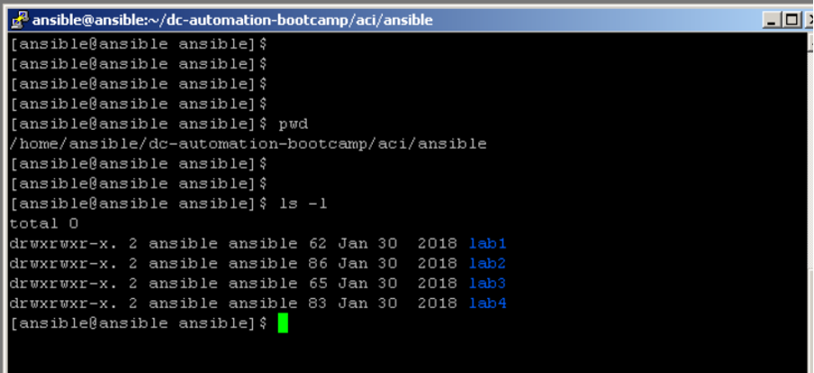


## Lab 1: Create Tenant

In this lab exercise, we’ll use a simple playbook to create a tenant.

1. Change to the aci/ansible/lab1 directory in the ansible host putty terminal. 

```
[ansible@ansible ~]$ cd ~/dc-automation-bootcamp/aci/ansible/lab1
```

2. Enter the following command in the ansible putty terminal to view or edit the ansible playbook in VI editor. 

```
[ansible@ansible lab1]$ vi create_tenant.yml
```
Go through the playbook to understand how it works. You should now be familiar with the syntax used in Ansible from the NXOS exercises. 

> NOTE: Ansible Modules used: aci_tenant – https://docs.ansible.com/ansible/latest/modules/aci_tenant_module.html


```
--- 
- name: playbook for testing tenants 
hosts: apic 
connection: local 
gather_facts: no 
tasks: 
- name: Add a new tenant 
aci_tenant: 
hostname: apic 
username: admin 
password: C1sco12345 
tenant: ACILab 
description: Test tenant 
state: present 
validate_certs: false
```

> NOTE: We use validate_certs: false to prevent ansible from validating SSL certificates. This should only be used on personally controlled sites using self-signed certificates.


3. Once you have gone through the playbook, exit the VI editor.

4. Run the ansible playbook by entering the below command in the putty terminal.

```
[ansible@ansible lab1]$ ansible-playbook create_tenant.yml –i inventory
```

After running, your terminal should look like this:

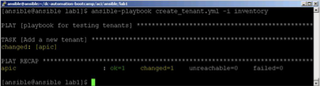

5. You may now use the Web browser on the remote desktop system to access the APIC controller Web UI. Navigate to the “Tenants” tab to see the result of running the previous script:

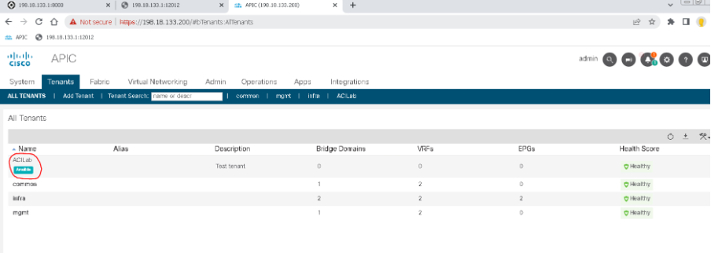


This concludes Lab 1.


## Lab 2: Create VRF and Bridge Domain

In the previous exercise, we had the configuration value stored within the Ansible playbook. This is not desirable for various reasons. Whenever one needs to change the configuration values, there’ll always be the risk of inadvertently changing the playbook code. It’s always best practice to separate the automation code and the configuration values. In this lab exercise, we’ll see how to do that.

We can store the configuration values within the inventory file or an external variables file. Note that, the values stored in inventory file are implicitly imported by Ansible, whereas the external variables file has to be explicitly imported.


1.	Change to the aci/ansible/lab2 directory in the ansible host putty terminal.

```
[ansible@ansible ~]$ cd ~/dc-automation-bootcamp/aci/ansible/lab2
```

2.	Some of the configuration values are stored as variables in the inventory file. These values are implicitly imported by Ansible. Look at the inventory file by entering the command below.

```
[ansible@ansible lab2]$ vi inventory
apic user=admin pass=C1sco12345
```

3.	Some of the configuration values are stored as variables in an external variables file. These values need to be explicitly imported by Ansible. Look at the external variables file by entering the command below. 

```
[ansible@ansible lab2]$ vi external_vars.yml 
--- 
vrf: 
name: ACILab_VRF 
description: A sample VRF used for ACILab 
tenant: ACILab 
bd: 
name: ACILab_BD1 
vrf: ACILab_VRF 
tenant: ACILab
```

4.	Enter the following command in the ansible putty terminal to view or edit the ansible playbook in VI editor.

```
[ansible@ansible lab2]$ vi create_vrf_bd.yml
```

Go through the playbook to understand how it works. Notice how the external variables file is explicitly imported in the playbook. 

> NOTE: Ansible Modules used: [aci_vrf](https://docs.ansible.com/ansible/2.5/modules/aci_vrf_module.html)

>  [aci_bd](https://docs.ansible.com/ansible/2.5/modules/aci_bd_module.html)

```
--- 
- name: playbook for creating bd 
hosts: apic
connection: local 
gather_facts: no 
vars_files: 
- external_vars.yml 
tasks: 
- name: Ensure VRF for tenant exists 
aci_vrf: 
vrf: "{{ vrf.name }}" 
description: "{{ vrf.description }}" 
tenant: "{{ vrf.tenant }}" 
state: present 
host: "{{ inventory_hostname }}" 
username: "{{ user }}" 
password: "{{ pass }}" 
validate_certs: false 
- name: Ensure Bridge Domain 1 exists 
aci_bd: 
bd: "{{ bd.name }}" 
vrf: "{{ bd.vrf }}" 
tenant: "{{ bd.tenant }}" 
state: present 
host: "{{ inventory_hostname }}" 
username: "{{ user }}" 
password: "{{ pass }}" 
validate_certs: false
```


5.	Once you have gone through the playbook, exit the VI editor.

6.	Run the ansible playbook by entering the below command in the putty terminal.

```
ansible@ansible lab2]$ ansible-playbook create_vrf_bd.yml –i inventory
```

After running, your terminal should look like this:

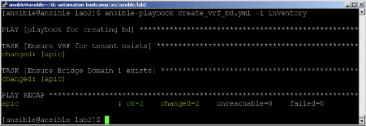

7.	You may now use the Web browser on the remote desktop system to access the APIC controller Web UI. Navigate to the “Tenants” tab, and double-click on the ACILab tenant. On the left-hand side of the page, navigate to open the “Networking” folder to see the BD and VRF which have been configured.

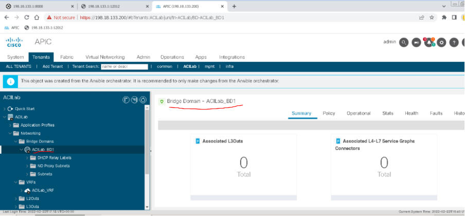

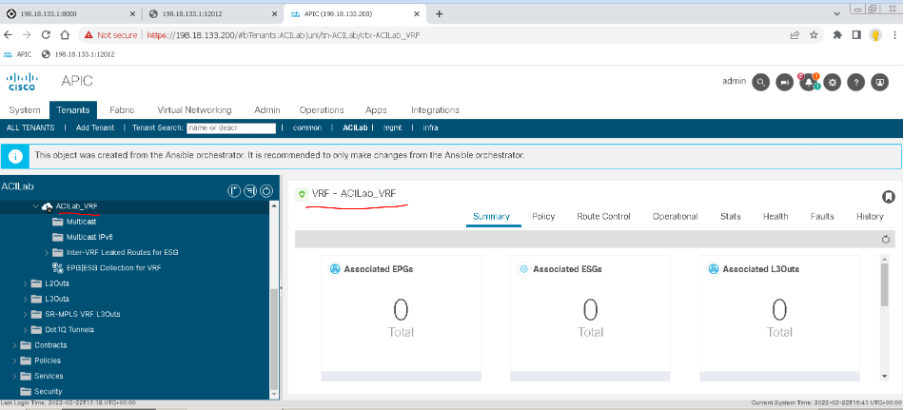

This concludes Lab 2.


## Lab 3: Create Contracts

In this lab exercise, we’ll look at how to reduce repetitive code by using loops. For example, when we need to create multiple contracts, instead of writing a playbook task for each contract, we can use with\_items loop. Note that the types of items you iterate over with ‘with_items’ do not have to be simple lists of strings. You can even iterate over a list of hashes (key=value pairs and other data structures).

In this lab exercise, we’ll use a playbook to create three contracts – web, app and db.

1.	Change to the aci/ansible/lab3 directory in the ansible host putty terminal.

```
[ansible@ansible ~]$ cd ~/dc-automation-bootcamp/aci/ansible/lab3
```

2.	Enter the following command in the ansible putty terminal to view or edit the ansible playbook in VI editor.

```
[ansible@ansible lab3]$ vi create_contracts.yml
```

Go through the playbook to understand how it works. Notice how the list of contract names is defined within the ansible task.
> NOTE: Ansible Modules used: 
[aci_contract](https://docs.ansible.com/ansible/2.5/modules/aci_contract_module.html)

```
--- 
- name: playbook for creating contracts 
hosts: apic 
connection: local 
gather_facts: no 
tasks: 
- name: ensure contracts exist 
aci_contract: 
name: "{{ item }}" 
tenant: ACILab 
host: "{{ inventory_hostname }}" 
username: "{{ user }}" 
password: "{{ pass }}" 
validate_certs: false 
with_items: 
- Web_Con 
- App_Con 
- DB_Con
```

3.	Once you have gone through the playbook, exit the VI editor.

4.	Run the ansible playbook by entering the below command in the putty terminal.

```
[ansible@ansible lab3]$ ansible-playbook create_contracts.yml –i inventory
```

After running, your terminal should look like this:

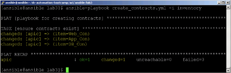

5.	You may now use the Web browser on the remote desktop system to access the APIC controller Web UI. Navigate to the “Tenants” tab and double-click on the ACILab tenant. On the left-hand side of the page, navigate to open the “Security Policies” and “Contracts” folder to see the Contracts which have been configured.

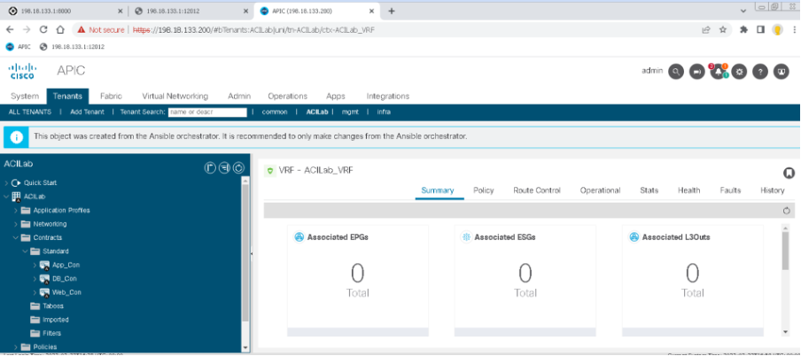

This concludes Lab 3.


## Lab 4: Create ANP and EPG

In this lab exercise, we create an End Point Group (EPG) and Application Network Profile (ANP). We will be using the Tenant and the Bridge Domain that we created in the previous lab exercises.

In this lab exercise, we’ll use a playbook to create three contracts – web, app and db.

1.	Change to the aci/ansible/lab4 directory in the ansible host putty terminal.


```
[ansible@ansible ~]$ cd ~/dc-automation-bootcamp/aci/ansible/lab4
```

2.	The configuration values are stored in an external file instead of the playbook itself. Look at the external variables file by entering the command below:

```
[ansible@ansible lab4]$ vi external_vars.yml
--- 
epg: Web_EPG 
bd: ACILab_BD1 
ap: 3Tier_App 
tenant: ACILab
```

3.	Enter the following command in the ansible putty terminal to view or edit the ansible playbook in VI editor.

```
[ansible@ansible lab4]$ vi create_epg.yml
```

Go through the playbook to understand how it works.

> NOTE: Ansible Modules used: 

> [aci_ap](https://docs.ansible.com/ansible/2.5/modules/aci_ap_module.html)

> [aci_epg](https://docs.ansible.com/ansible/2.5/modules/aci_epg_module.html)

```
--- 
- name: playbook for creating bd 
hosts: apic 
connection: local 
gather_facts: no 
vars_files: 
- external_vars.yml 
tasks: 
- name: create app network profile 
aci_ap: 
ap: "{{ ap }}" 
tenant: "{{ tenant }}" 
state: present 
hostname: "{{ inventory_hostname }}" 
username: "{{ user }}" 
password: "{{ pass }}" 
validate_certs: false 
- name: ensure web epg exists 

aci_epg:
epg: "{{ epg }}" 
bd: "{{ bd }}" 
ap: "{{ ap }}" 
tenant: "{{ tenant }}" 
state: present 
hostname: "{{ inventory_hostname }}" 
username: "{{ user }}" 
password: "{{ pass }}" 
validate_certs: false
```

4.	Once you have gone through the playbook, exit the VI editor.

5.	Run the ansible playbook by entering the below command in the putty terminal.

```
[ansible@ansible lab4]$ ansible-playbook create_epg.yml –i inventory
```

6.	After running, your terminal should look like this:

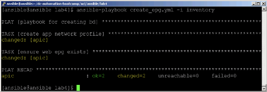


7. You may now use the Web browser on the remote desktop system to access the APIC controller Web UI. Navigate to the “Tenants” tab, and double-click on the ACILab tenant. On the left-hand side of the page, navigate to open the “Application Profiles” and “3Tier\_App”, “Application EPGs” and “Web\_EPG” folder to see the EPG which has been configured.

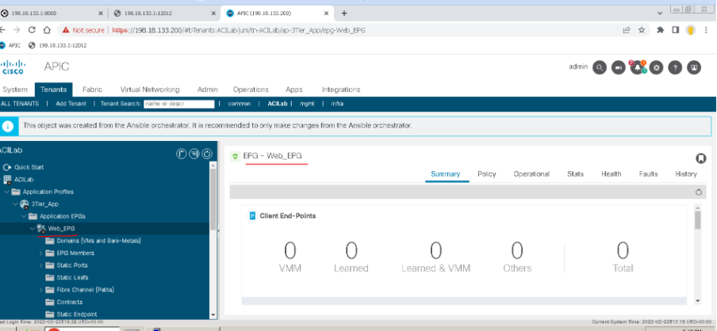

This concludes Lab 4.